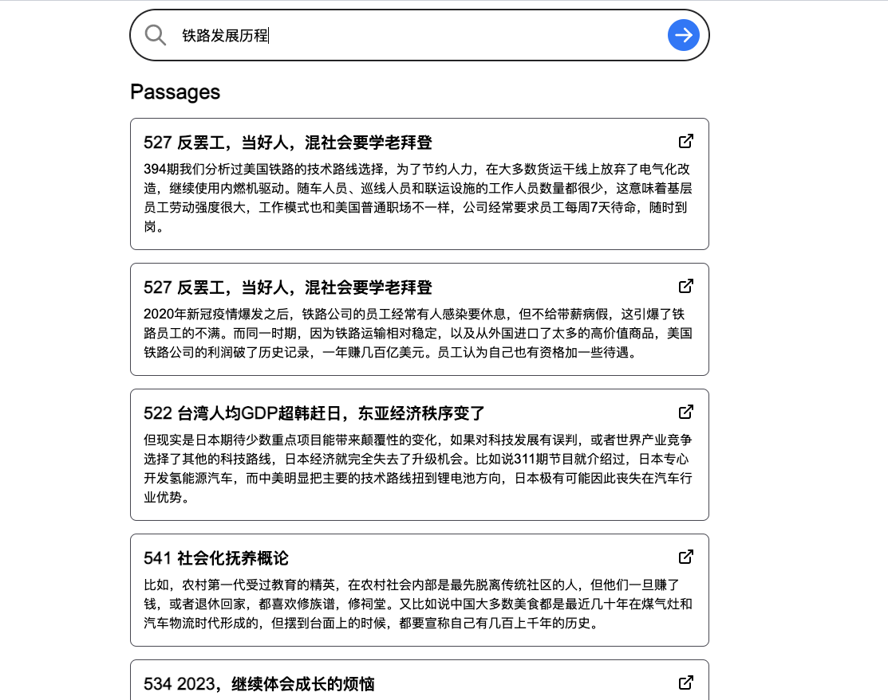
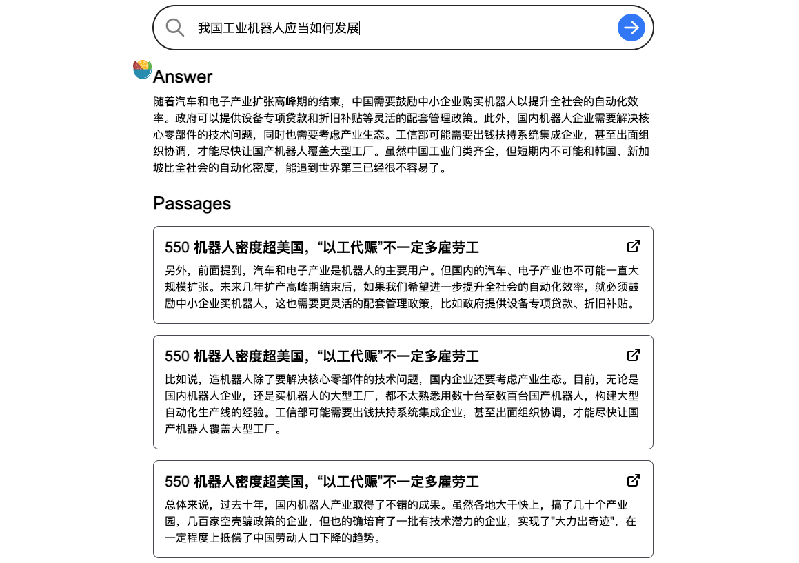

# 原项目

使用 ChatGPT 的技术与诗歌集对话 [Paul Graham's](https://github.com/mckaywrigley/paul-graham-gpt)

# 睡前消息数据集


从[睡前消息在线文稿](https://archive.bedtime.news/)中爬取下来，爬虫算法详见`scrape_info.ts`

根据原文章的段落分割，将数据按照`@types/index.ts`中的数据定义，先经过 ChatGPT-Embedding 后上传至[supabase](https://app.supabase.com)

上图中整理好的稿件文本，我已处理好至数据库中：[https://app.supabase.com/project/cztlxgqsdztvoirjhjqj](https://app.supabase.com/project/cztlxgqsdztvoirjhjqj)，可以自行再做处理

## 如何使用

有两种使用方法:

1. 搜索接口
2. chat 接口

### 搜索

搜索功能基于 [OpenAI Embeddings](https://platform.openai.com/docs/guides/embeddings) (`text-embedding-ada-002`).

首先将文章分段，每一段都经过 Embedding，并切数据储存在 supabase 中

在调用时，我们的输入文字会通过 Embedding，然后和数据集所有的片段计算语义相似度，然后会返回语义最相近的结果，返回结果的数量可以在 settings 中设置

通过搜索接口，可以快速找到想要的相关内容片段及其对应的文稿链接，快速跳转到该文稿页面查看当期睡前消息



### Chat

Chat 功能基于搜索功能，将搜索结果的片段作为 ChatGPT 的提示输入，然后让其返回相关内容描述

这样，可以实现类似于对话的功能，借助 ChatGPT 与以往所有睡前消息进行交流，让其为我们做总结、归纳、或者拓展



### Requirements

1. Set up OpenAI

You'll need an OpenAI API key to generate embeddings.

2. Set up Supabase and create a database

Note: You don't have to use Supabase. Use whatever method you prefer to store your data. But I like Supabase and think it's easy to use.

There is a schema.sql file in the root of the repo that you can use to set up the database.

Run that in the SQL editor in Supabase as directed.

I recommend turning on Row Level Security and setting up a service role to use with the app.

### Repo Setup

3. Clone repo

```bash
git clone https://github.com/mckaywrigley/paul-graham-gpt.git
```

4. Install dependencies

```bash
npm i
```

5. Set up environment variables

Create a .env.local file in the root of the repo with the following variables:

```bash
OPENAI_API_KEY=

NEXT_PUBLIC_SUPABASE_URL=
SUPABASE_SERVICE_ROLE_KEY=
```

### Dataset

6. Run scraping script

```bash
npm run scrape
```

This scrapes all of the essays from Paul Graham's website and saves them to a json file.

7. Run embedding script

```bash
npm run embed
```

This reads the json file, generates embeddings for each chunk of text, and saves the results to your database.

There is a 200ms delay between each request to avoid rate limiting.

This process will take 20-30 minutes.

### App

8. Run app

```bash
npm run dev
```

## Credits

Thanks to [Paul Graham](https://twitter.com/paulg) for his writing.

I highly recommend you read his essays.

3 years ago they convinced me to learn to code, and it changed my life.

## Contact

If you have any questions, feel free to reach out to me on [Twitter](https://twitter.com/mckaywrigley)!

## Notes

I sacrificed composability for simplicity in the app.

Yes, you can make things more modular and reusable.

But I kept pretty much everything in the homepage component for the sake of simplicity.
